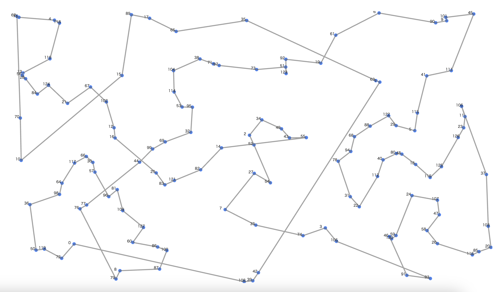
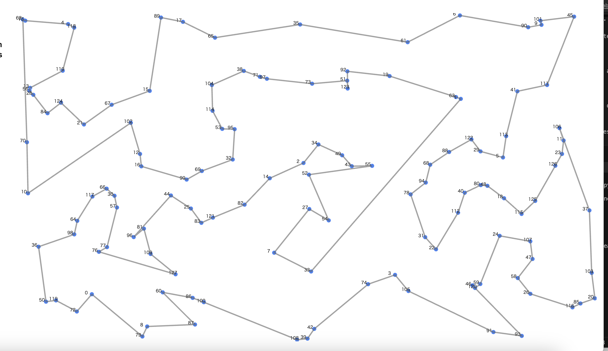

# googleSTEP

## File Descriptions

| File name, folder name               | Usage                             | Command |
|-----------------------|--------------------------------------------------|---------|
| solver_2opt_original.py            | TSP using original 2 opt                        |python solver_2opt_original.py input_file output_file|
| solver_2opt.py                     | TSP using 2 opt                                 |python solver_2opt.py input_file output_file|
| solver_greedy_2_opt_or_1_opt.py    | TSP using greedy and 2 opt and or_1_opt         |python solver_greedy_2_opt_or_1_opt.py input_file output_file|
| solver_greedy_2_opt_or_1_opt_or_2_opt.py | TSP using greedy and 2 opt and or_1opt and or_2_opt                             |python solver_greedy_2_opt_or_1_opt_or_2_opt.py input_file output_file|
| solver_annealing.py               | TSP using annealing and 2 opt and or_1opt and or_2_opt                             |python solver_annealing.py input_file output_file|

# Homework
## Overview
Find the shorter path that visit all the cities and return to the first city.

## Algorithm
Utilize opt-2 algorithm to detect the intersection in the path and untie it to make the path shorter.

1. Add new city to the current path.

2. If the new path has an intersection with any previous path, untie it.

3. Iterate it until the end, and considering that the path still has intersections, untie it until it has no circle in the path.

## Structure
To make the code more easy to read, we utilized several class object to assign different role for each class.

1. City class
Represents the city and has attributes of x coordinate and y coordinate of the position and its name.

2. Intersection class
Responsible to judge whether two lines that are made of four City classes have an intersection.

3. Path class
Represents the current path and responsible to update the path and untie it if necessary.

## Results
By the way, the visualizer that was provided did not show the number next to the city, so I added some codes so that the number can be seen.

When N = 128

Greedy

Opt2 (own way)

